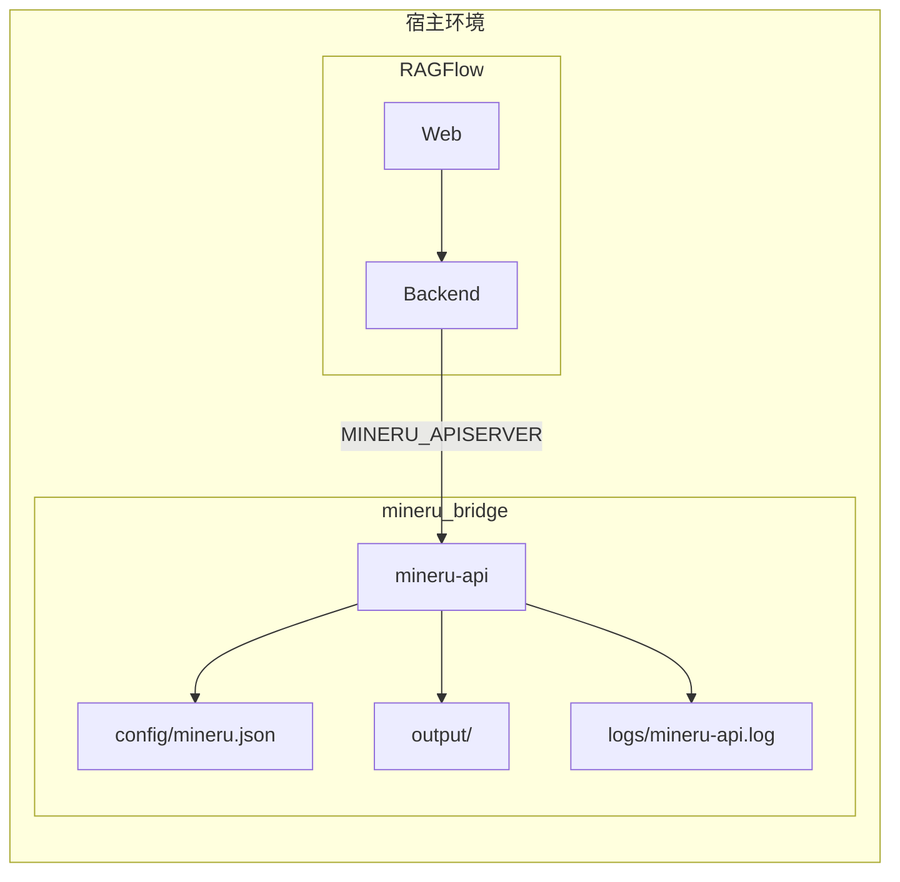
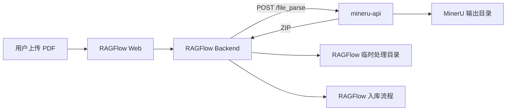
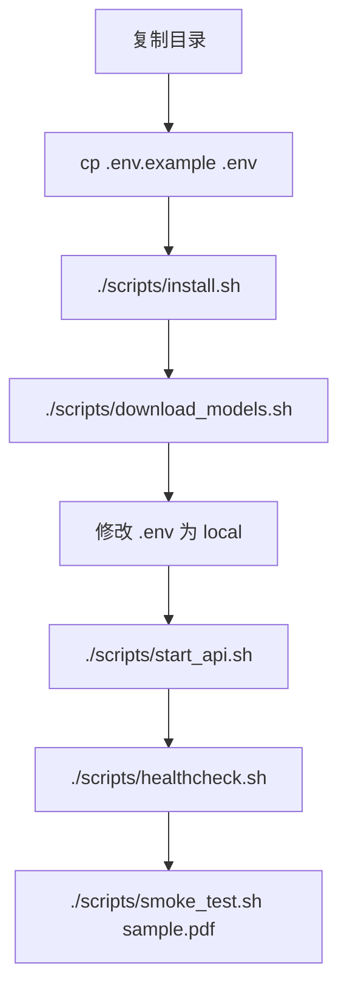
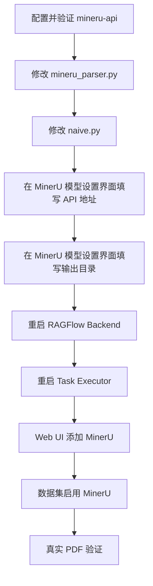
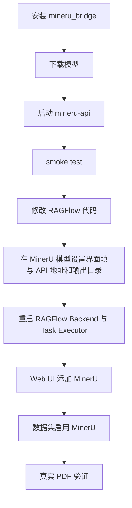
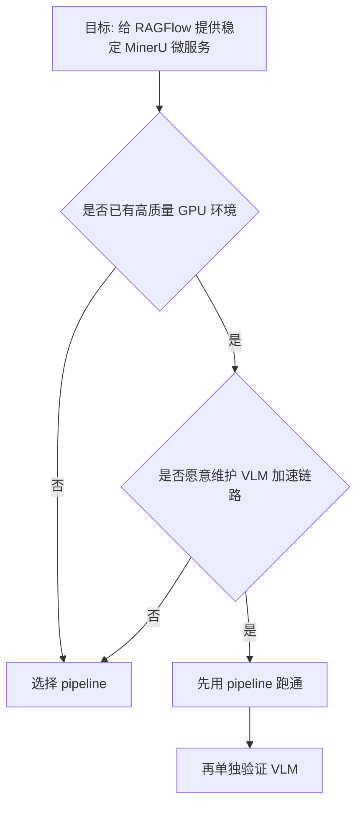
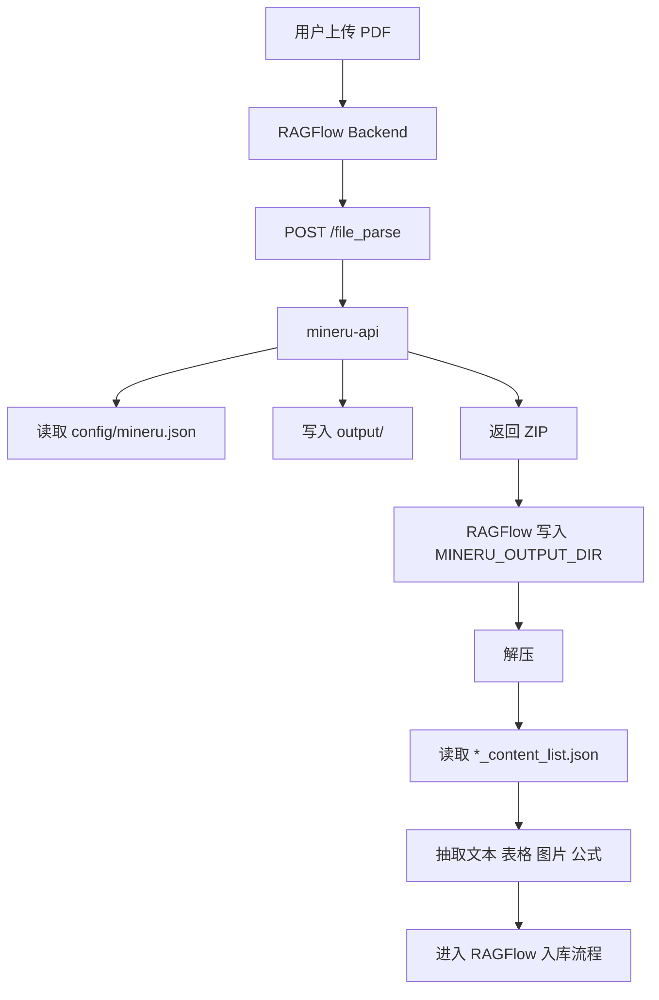
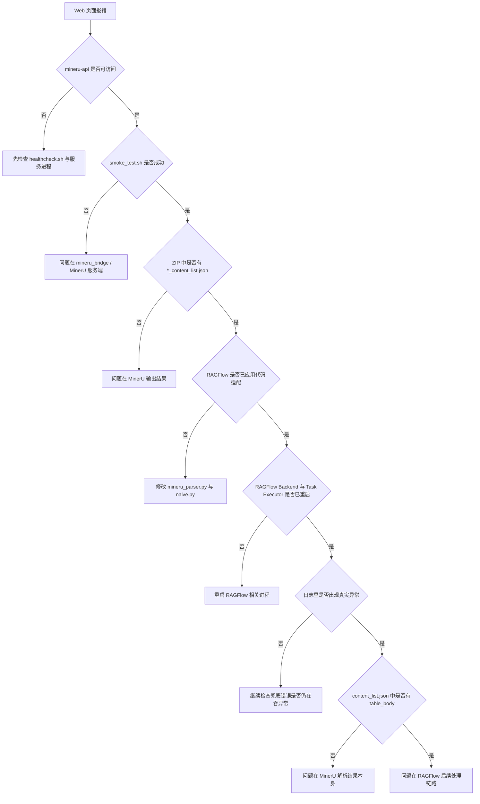
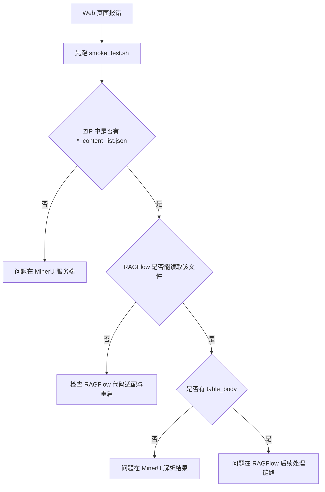

# MinerU Bridge

>**RAGFlow**是一款领先的开源检索增强生成（RAG）引擎，它将尖端的RAG技术与Agent功能相结合，为大型语言模型（LLM）构建了一个卓越的上下文层。 

>**MinerU**是一款专为大型语言模型（LLM）、检索增强生成（RAG）和智能体工作流程打造的开源、高精度文档解析引擎。该引擎由上海人工智能实验室的OpenDataLab团队开发，是一站式解决方案，可将非结构化文档（如PDF、图像和DOCX文件）转换为机器可读的格式，如Markdown和JSON。

>`mineru_bridge` 是一个面向 **RAGFlow** 的 **MinerU** 微服务部署方案。

它的目标很简单：

- 不把 MinerU 直接塞进 RAGFlow 主环境. RAGFlow 和 `mineru_bridge` 各自独立运行，两者通过本机 HTTP 通讯
- 直接复用官方 `mineru-api`
- 给 RAGFlow 提供一个稳定、可独立安装、可独立运维、可独立排障的 PDF 解析微服务



## 先看效果

接入完成后，整体调用关系如下：



对使用者来说，效果是：

1. 在 RAGFlow 中选择 `MinerU` 作为 PDF parser
2. RAGFlow 将 PDF 发送给 `mineru-api`
3. MinerU 返回包含 `*_content_list.json` 的 ZIP
4. RAGFlow 读取其中的文本、表格、图片、公式结果并进入后续入库流程

## 实测环境

| 组件 | 说明 |
| --- | --- |
| RAGFlow | `v0.24.x` 路线 |
| MinerU | 官方 `3.x` 路线 |
| 接入方式 | RAGFlow 远程调用 `mineru-api` |

RAGFlow 和 `mineru_bridge` 跑在 同一个 WSL上, RAGFlow 通过 `127.0.0.1:8886` 访问 MinerU

## MinerU 3.x 能力边界

本方案基于官方 MinerU 3.x 的当前能力设计，重点依赖以下事实：

- `mineru-api` 保留了 `POST /file_parse` 兼容接口
- 返回结果中仍然包含 `content_list.json`
- 表格结果仍然通过 `table` 块和 `table_body` 表达

这使得它可以作为 RAGFlow 的一个远程 PDF parser 服务。

## 安装前的建议

在开始之前，建议先接受两个工程原则：

- MinerU 不要直接装进 RAGFlow 主环境
- 默认优先使用 `pipeline`，不要一开始就上 `VLM`

原因很简单：

- 依赖隔离更清晰
- 升级和回滚更容易
- 故障边界更明确
- 在 RAGFlow 场景里，优先目标是“稳定解析”，不是“追逐最复杂的推理链路”

## 目录结构

```text
mineru_bridge/
  .env.example
  .python-version
  pyproject.toml
  config/
  logs/
  output/
  tmp/
  scripts/
```

各目录职责如下：

| 路径 | 作用 |
| --- | --- |
| `config/` | MinerU 本地配置文件 |
| `logs/` | `mineru-api` 运行日志 |
| `output/` | MinerU 服务端任务输出目录 |
| `tmp/` | 可供 RAGFlow 作为临时处理目录使用 |
| `scripts/` | 安装、下载、启动、检查脚本 |

## 安装与运行

### 1. 准备目录

将 `mineru_bridge` 放到你希望部署的位置，例如：

```bash
cd /path/to/project
cp -r mineru_bridge /path/to/mineru_bridge
cd /path/to/mineru_bridge
```

### 2. 准备环境变量

```bash
cp .env.example .env
```

`.env.example` 中的变量都带了中文注释，通常默认值就可以先跑起来。

### 3. 安装运行时

```bash
./scripts/install.sh
```

这个步骤会：

- 用 `uv` 创建独立虚拟环境
- 安装官方 `mineru[core]`
- 检查 `mineru-api`、`mineru`、`mineru-models-download` 命令是否可用

### 4. 下载模型

推荐先下载本地模型，再切换到离线模式：

```bash
MINERU_MODEL_SOURCE=modelscope ./scripts/download_models.sh
```

下载完成后，建议把 `.env` 中的：

```env
MINERU_MODEL_SOURCE=local
```

这样后续服务启动时优先走本地模型。

### 5. 启动服务

```bash
./scripts/start_api.sh
```

默认监听：

- host: `0.0.0.0`
- port: `8886`

### 6. 健康检查

```bash
./scripts/healthcheck.sh
```

### 7. 冒烟测试

```bash
./scripts/smoke_test.sh /absolute/path/to/sample.pdf
```

这个脚本会检查：

- `POST /file_parse` 是否可用
- 返回 ZIP 中是否包含 `*_content_list.json`
- 返回结果中是否存在 `table` 块和 `table_body`

## 一页看懂安装流程



## RAGFlow 侧如何接入

对外接入分成两部分：

- Web 设置
- 代码适配

前者解决“如何连上微服务”，后者解决“如何正确读取官方 MinerU 3.x 返回结果”。

### RAGFlow 设置界面如何填写

推荐优先在 RAGFlow 的 MinerU 模型设置界面中完成配置，而不是先记变量名。

在 RAGFlow Web 中进入：

1. `User Setting`
2. `Model`
3. `Add Model`
4. 选择 `MinerU`

然后按下面方式填写：

| 界面字段 | 应填写的内容 | 说明 |
| --- | --- | --- |
| 模型名称 | 自定义名称，例如 `MinerU_Local` | 用于在 RAGFlow 中标识这套 MinerU 配置 |
| MinerU API 服务器配置 | `http://127.0.0.1:8886` | 指向正在运行的 `mineru-api` |
| MinerU 输出目录路径 | `/path/to/mineru_bridge/tmp/ragflow_output` | 供 RAGFlow 保存、解压、处理 MinerU 返回 ZIP / JSON |
| MinerU 处理后端类型 | `pipeline` | 推荐默认值 |
| 处理完成后删除输出文件 | 可先保持开启 | 需要保留中间文件排障时再关闭 |

其中最关键的两个输入框就是：

- `MinerU API 服务器配置`
- `MinerU 输出目录路径`

可以直接把它们理解成：

- 第一个告诉 RAGFlow 去哪里调用 MinerU 服务
- 第二个告诉 RAGFlow 把 MinerU 返回结果临时放到哪里处理

### 在知识库中启用 MinerU

进入数据集(Dataset)配置后，建议按下面的方式开始：

- `PDF parser = MinerU`
- `backend = pipeline`
- `parse method = auto`
- `table parsing = 开启`
- `formula parsing = 开启`

### RAGFlow 需要修改哪些代码

如果直接使用当前很多 RAGFlow 版本里的 MinerU 逻辑，会遇到一个实际问题：

- MinerU 服务端已经成功返回 ZIP
- ZIP 中也确实存在 `*_content_list.json`
- 但 RAGFlow 仍然报错，或者最终显示 `No chunk built`

根因通常在于：RAGFlow 侧对官方 MinerU 3.x 的输出目录结构支持不完整。

#### 需要修改的代码文件

需要关注两个位置：

- `deepdoc/parser/mineru_parser.py`
- `rag/app/naive.py`

##### 修改 1：扩展 `content_list.json` 的搜索路径

官方 MinerU 3.x 返回的 ZIP 解压后，结果文件不一定直接落在根目录，也可能出现在：

- `ocr/`
- `txt/`
- `auto/`
- 其它 method 对应子目录

因此，`deepdoc/parser/mineru_parser.py` 需要支持：

- 优先检查 method 目录
- 检查 `ocr/`、`txt/`、`auto/`
- 最后做一次递归兜底搜索 `*_content_list.json`

否则会出现一种表面很诡异、实际很常见的错误：

- MinerU 服务端成功
- `content_list.json` 实际存在
- RAGFlow 因为没在正确目录里找到文件而误判失败

修改为：

- 不再只查根目录
- 增加 method 子目录检查
- 增加 `ocr/`、`txt/`、`auto/` 等目录检查
- 最后用递归搜索兜底

```diff
diff --git a/deepdoc/parser/mineru_parser.py b/deepdoc/parser/mineru_parser.py
@@
-        jf = output_dir / f"{file_stem}_content_list.json"
-        attempted.append(jf)
-        if jf.exists():
-            subdir = output_dir
-            json_file = jf
-        else:
-            nested_alt = output_dir / safe_stem / f"{safe_stem}_content_list.json"
-            attempted.append(nested_alt)
-            if nested_alt.exists():
-                subdir = nested_alt.parent
-                json_file = nested_alt
+        candidate_dirs = [output_dir]
+        if method:
+            candidate_dirs.append(output_dir / method)
+        candidate_dirs.extend(
+            [
+                output_dir / "auto",
+                output_dir / "ocr",
+                output_dir / "txt",
+                output_dir / safe_stem,
+            ]
+        )
+
+        seen_dirs = set()
+        candidate_dirs = [p for p in candidate_dirs if not (p in seen_dirs or seen_dirs.add(p))]
+
+        for candidate_dir in candidate_dirs:
+            for candidate_name in (f"{file_stem}_content_list.json", f"{safe_stem}_content_list.json"):
+                candidate = candidate_dir / candidate_name
+                attempted.append(candidate)
+                if candidate.exists():
+                    subdir = candidate.parent
+                    json_file = candidate
+                    break
+            if json_file:
+                break
+
+        if not json_file:
+            recursive_candidates = []
+            for candidate_name in (f"{file_stem}_content_list.json", f"{safe_stem}_content_list.json"):
+                recursive_candidates.extend(sorted(output_dir.rglob(candidate_name)))
+            if recursive_candidates:
+                json_file = recursive_candidates[0]
+                subdir = json_file.parent
```

这个改动解决的是：

- MinerU 服务端明明成功返回了 ZIP
- `content_list.json` 也确实存在
- 但文件落在 `ocr/` 之类的子目录中
- 旧逻辑找不到，于是 RAGFlow 误判失败


##### 修改 2：保留真实错误，不要全部报成 `MinerU not found`

`rag/app/naive.py` 里对 MinerU 解析失败的兜底处理，建议不要把所有异常都统一报成：

```text
MinerU not found.
```

更合理的做法是：

- 如果真的是没配置 MinerU，再报 `not found`
- 如果是解析过程中失败，就把真实错误透出来

这样才能区分：

- 是服务没配
- 还是服务返回了结果，但 RAGFlow 读取失败

修改为：

- 不再把所有失败都统一报成 `MinerU not found.`
- 保留真正的异常信息

```diff
diff --git a/rag/app/naive.py b/rag/app/naive.py
@@
-    pdf_parser = None
+    pdf_parser = None
+    last_error = None
@@
-            except Exception as e:  # best-effort fallback
-                logging.warning(f"fallback to env mineru: {e}")
+            except Exception as e:  # best-effort fallback
+                logging.warning(f"fallback to env mineru: {e}")
+                last_error = e
@@
-            except Exception as e:
-                logging.error(f"Failed to parse pdf via LLMBundle MinerU ({mineru_llm_name}): {e}")
+            except Exception as e:
+                logging.error(f"Failed to parse pdf via LLMBundle MinerU ({mineru_llm_name}): {e}")
+                last_error = e
@@
-    if callback:
-        callback(-1, "MinerU not found.")
+    if callback:
+        if last_error:
+            callback(-1, f"MinerU parse failed: {last_error}")
+        else:
+            callback(-1, "MinerU not found.")
```

这个改动解决的是：

- 服务端已经返回了结果
- 但 RAGFlow 读取时出错
- Web 页面却只显示 `MinerU not found.`

这种误导性错误会极大增加排障成本，因此建议一定要改。


#### RAGFlow 侧改动清单

| 文件 | 改动点 | 目的 |
| --- | --- | --- |
| `deepdoc/parser/mineru_parser.py` | 扩展 `content_list.json` 搜索路径 | 适配官方 3.x 返回目录结构 |
| `deepdoc/parser/mineru_parser.py` | 增加 method 子目录、`ocr/`、`txt/`、`auto/` 以及递归兜底搜索 | 解决 ZIP 已返回但读取失败的问题 |
| `rag/app/naive.py` | 不再把所有异常都报成 `MinerU not found.` | 让真实错误可见 |
| RAGFlow 模型设置界面 | 填写 `MinerU API 服务器配置` | 让 RAGFlow 能访问 MinerU 微服务 |
| RAGFlow 模型设置界面 | 填写 `MinerU 输出目录路径` | 让 RAGFlow 有自己的结果处理目录 |
| RAGFlow Web 配置 | 添加 `MinerU` 模型并保存 | 让前端可选择 MinerU |
| 数据集解析配置 | 使用 `MinerU + pipeline + auto` | 以最稳配置先跑通链路 |


#### 建议的改动顺序


#### 接入步骤总览



#### 数据集(Dataset)中Minuer配置参数配置

如果你是第一次接入，建议从这组默认配置开始：

| 项目 | 推荐值 |
| --- | --- |
| MinerU backend | `pipeline` |
| parse method | `auto` |
| 表格解析 | 开启 |
| 公式解析 | 开启 |


## `pipeline` 与 `VLM` 应该怎么选

MinerU 当前可以理解成两条路线：

- `pipeline`
- `VLM`

### `pipeline`

`pipeline` 是传统多小模型流水线。

例如：

- OCR 用 PaddleOCR
- 表格检测用专用表格模型
- 表格分类、方向分类、版面分析由不同小模型协作完成
- 最终由 MinerU 做统一后处理

优点是：

- 稳定
- 成熟
- 硬件要求低
- 易部署
- 更适合作为 RAGFlow 的默认生产方案

### `VLM`

`VLM` 是端到端多模态模型路线。

它直接用一个多模态模型去理解文档结构，理论上在复杂版面、多语言、手写、公式等场景更有潜力。

但工程上要注意：

- 未加速的 `VLM` 很慢
- 实际生产里通常要搭配 `SGLang` 或类似加速链路
- Windows 原生环境并不适合作为这类加速方案的优先部署环境

### 在 RAGFlow 场景下的建议

如果目标是“先把 RAGFlow 稳定接通，并且优先解决表格解析”，建议：

- 默认使用 `pipeline`
- 不要把未加速的 `VLM` 当默认方案
- 只有在高配 NVIDIA GPU + Linux 环境 + 具备加速栈维护能力时，再单独评估 `VLM`

### 选型决策图



## 三类目录一定要分清

`mineru_bridge` 接入 RAGFlow 后，最容易混淆的是这三类目录：

| 路径 | 谁使用 | 作用 |
| --- | --- | --- |
| `config/mineru.json` | MinerU | 模型与运行配置 |
| `output/` | MinerU | 服务端任务输出 |
| `MINERU_OUTPUT_DIR` | RAGFlow | 返回 ZIP 的本地保存、解压、处理目录 |

它们不是一回事，路径不同是正常的。

## 文件生命周期

下面这张图展示的是一个 PDF 从上传到入库的大致生命周期：



## 运维方式

### 直接命令启动

```bash
./scripts/start_api.sh
```

### `systemd` 托管

如果你希望把它作为长期服务运行，建议使用 `systemd`。

示例：

```ini
[Unit]
Description=MinerU Bridge API Service
After=network.target

[Service]
Type=simple
User=your_user
WorkingDirectory=/path/to/mineru_bridge
ExecStart=/path/to/mineru_bridge/scripts/start_api.sh
Restart=always
RestartSec=5

[Install]
WantedBy=multi-user.target
```

部署步骤：

```bash
sudo vim /etc/systemd/system/mineru-bridge.service
sudo systemctl daemon-reload
sudo systemctl enable mineru-bridge
sudo systemctl start mineru-bridge
sudo systemctl status mineru-bridge
```

常用命令：

```bash
sudo systemctl restart mineru-bridge
sudo systemctl stop mineru-bridge
sudo journalctl -u mineru-bridge -f
```

## 故障排查

### 场景 1：`/openapi.json` 能访问，但 RAGFlow 仍然失败

先不要猜配置，直接做两件事：

1. 运行 `smoke_test.sh`
2. 检查返回 ZIP 中是否有 `*_content_list.json`

如果 ZIP 自己都没有结果文件，问题在 MinerU 侧。  
如果 ZIP 里有结果文件，但 RAGFlow 仍然失败，问题在 RAGFlow 读取链路。

### 场景 2：Web 上提示 `No chunk built`

优先检查：

- `content_list.json` 是否存在
- 结果文件是否在 `ocr/`、`txt/`、`auto/` 子目录中
- RAGFlow 是否已经应用了前面提到的代码修改
- RAGFlow 后端和任务执行器是否已经重启

### 场景 3：日志里报 `MinerU not found`

这个错误需要分两种情况：

- 真的没有配置 MinerU
- 其实 MinerU 已配置，但解析过程中抛了异常，错误信息被错误地统一吞掉

因此建议按前文方式修改 `rag/app/naive.py`，保留真实异常。

### 场景 4：首次请求很慢

这是正常现象，原因可能是：

- 首次模型加载
- OCR / 表格模型初始化
- VLM 预热

### 面向 Web 报错场景的排障决策树

如果你在 Web 页面上看到的是“任务失败”“No chunk built”或者其他泛化错误，建议按下面这张图排查，而不要直接猜是模型、路径还是代码问题。



### 最实用的排查顺序

如果你只想记住一条最实用的顺序，就按这个来：

1. 先看 `mineru-api` 是否正常
2. 再跑 `smoke_test.sh`
3. 再看 ZIP 中是否存在 `*_content_list.json`
4. 再看 `content_list.json` 里是否存在 `table_body`
5. 再确认 RAGFlow 是否已经应用代码修改并重启
6. 最后才去查 RAGFlow 后续入库和 chunk 构建逻辑

### 故障排查图



## 参考资料

- MinerU GitHub: <https://github.com/opendatalab/MinerU>
- MinerU 文档: <https://opendatalab.github.io/MinerU/>
- CLI 工具说明: <https://opendatalab.github.io/MinerU/usage/cli_tools/>
- 模型来源说明: <https://opendatalab.github.io/MinerU/usage/model_source/>
- 输出文件说明: <https://opendatalab.github.io/MinerU/zh/reference/output_files/>


